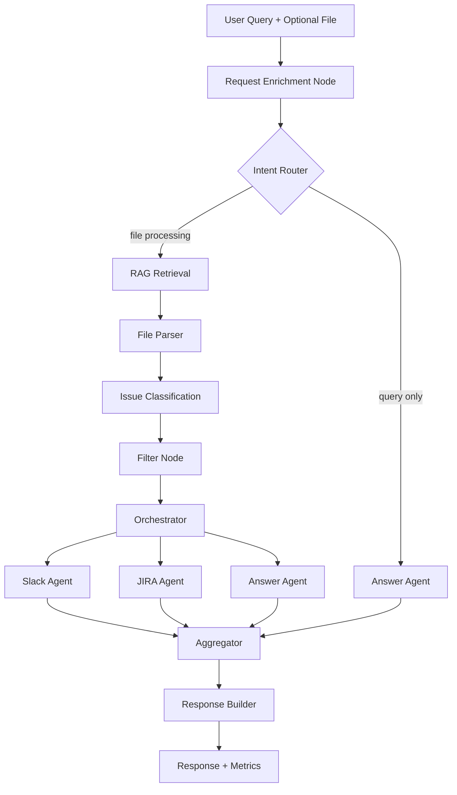

# PRODUCT REQUIREMENTS DOCUMENT (PRD)

---

# 1. Product Overview

## 1.1 Product Name

**QA Intelligence Agent (QAIA)**

---

## 1.2 Product Summary

QA Intelligence Agent (QAIA) is a production-grade AI agent system that accepts natural language queries — with or without an uploaded QA issue file — and dynamically determines what to do:

1. Understands user intent from the query
2. Decides whether file processing is needed
3. Applies dynamic filtering criteria (accuracy, performance, security, etc.)
4. Routes results to the right output channels (Slack, JIRA, or direct answer)
5. Provides full observability and evaluation metrics

The system is **intent-driven**: a single flexible pipeline replaces multiple hardcoded workflows. The "filter accuracy issues → post Slack + create JIRA tickets" scenario is one of many supported flows.

This system is designed to demonstrate **LLM Engineering in production**, not academic experimentation.

---

# 2. Product Vision

Build a robust, scalable AI agent system that demonstrates:

* Intent-driven orchestration
* RAG-centered decision making
* Dynamic filter criteria extraction
* Conditional pipeline routing
* Parallel sub-agent execution
* Tool integration with failure isolation
* Observability-first architecture
* Low-latency mindset with measurable quality

---

# 3. Problem Statement

QA teams generate large issue lists and have diverse, ad-hoc needs:

* "Find all accuracy bugs and post a summary to Slack"
* "Create JIRA tickets for all P1 security issues"
* "What are common performance issues in ML systems?"
* "Summarize everything critical in this file"

Challenges:

* User intent is ambiguous — needs structured interpretation
* Filter criteria vary per request — "accuracy" is not always the concern
* File upload is not always necessary — some requests are pure Q&A
* Output channels vary — Slack, JIRA, or just an inline answer
* LLM hallucination risk without RAG grounding
* Lack of observability makes debugging difficult

---

# 4. Goals & Non-Goals

## 4.1 Goals

* Interpret any QA-related user intent reliably
* Determine dynamically whether file processing is needed
* Extract filter criteria from natural language (not hardcoded)
* Use RAG to ground classification logic for any issue type
* Activate only the agents required by the specific request
* Execute Slack + JIRA in parallel when both are needed
* Provide full trace visibility
* Maintain predictable latency
* Support concurrent usage

---

## 4.2 Non-Goals

* No multi-agent swarm system
* No autonomous planning agents
* No long-term memory
* No MCP/A2A protocol
* No advanced orchestrator framework

---

# 5. User Personas

### Primary

* QA engineers
* Backend engineers
* AI engineers

### Secondary

* Engineering managers

---

# 6. Example User Flows

The following examples illustrate the system's flexibility. All start with a natural language query.

| Query | File? | Enriched Intent | Agents Activated |
|-------|-------|-----------------|-----------------|
| "Find accuracy issues and post to Slack and create tickets" | ✅ | filter_and_report | Slack + JIRA |
| "Summarize all P1 bugs from this file" | ✅ | analyze | Answer |
| "Create JIRA tickets for security vulnerabilities" | ✅ | update | JIRA |
| "What are common performance issues in ML systems?" | ❌ | query | Answer |
| "Post all critical issues to Slack" | ✅ | filter_and_report | Slack |

---

# 7. High-Level System Architecture



---

# 8. Technology Stack (Fixed)

| Layer | Technology |
|-------|-----------|
| API | FastAPI |
| Workflow | LangGraph |
| LLM | OpenAI GPT-4o |
| Embedding Model | text-embedding-3-small |
| Vector Store | Qdrant |
| Backend | FastAPI |
| Observability | LangSmith |
| Evaluation & Analytics | Langfuse |
| Concurrency Model | Async + Parallel Graph Branches |

---

# 9. Functional Requirements

---

## 9.1 File Upload (Optional)

### Supported Formats

* CSV
* Excel
* Markdown
* TXT

### Endpoint

POST /qa-intake

Request body:
* `file` (optional): multipart/form-data
* `instruction` (required): string — the user's natural language query

Returns:
* `request_id`
* `status`
* Structured response based on intent

---

## 9.2 Request Enrichment Node

### Purpose

Transform any user instruction into a structured task contract that drives the entire execution pipeline.

### Example Inputs → Outputs

Input: `"Find accuracy issues in this file and post to Slack and create tickets"`

Output:
```json
{
  "intent": "filter_and_report",
  "requires_file_processing": true,
  "filter_criteria": {
    "type": "accuracy",
    "description": "Issues involving incorrect outputs, wrong calculations, or misclassified data",
    "confidence_threshold": 0.6
  },
  "requires_slack_post": true,
  "requires_ticket_creation": true,
  "requires_analysis": false,
  "output_format": "executive"
}
```

Input: `"What are common performance issues in ML systems?"`

Output:
```json
{
  "intent": "query",
  "requires_file_processing": false,
  "filter_criteria": null,
  "requires_slack_post": false,
  "requires_ticket_creation": false,
  "requires_analysis": true,
  "output_format": "detailed"
}
```

---

## 9.3 Intent Router

After enrichment, the system routes to:

* **Query path**: if `requires_file_processing == false` → Answer Agent directly
* **File processing path**: if `requires_file_processing == true` → full pipeline

---

## 9.4 RAG Retrieval Node (Conditional)

The system retrieves relevant knowledge grounded in the request's `filter_criteria.type`:

* For accuracy → retrieves accuracy taxonomy
* For performance → retrieves performance taxonomy
* For security → retrieves security taxonomy
* For any custom type → retrieves most relevant documents

Output: Structured definition object used for downstream classification.

---

## 9.5 File Parser Node (Conditional)

Activated only when `requires_file_processing == true`.

Parses uploaded QA file into normalized issue list.

---

## 9.6 Issue Classification Node (Conditional)

Activated only when `filter_criteria` is not null.

Classifies each issue using:
* RAG-retrieved taxonomy for the requested `filter_criteria.type`
* LLM reasoning

If `filter_criteria` is null (e.g., intent is "summarize all issues") → skip classification, pass all issues to orchestrator.

---

## 9.7 Filter Node (Conditional)

Activated only when classification was performed.

Retains issues matching `filter_criteria` above `confidence_threshold`.

---

## 9.8 Orchestrator Node

Responsibilities:
* Generate sub-agent specific queries based on enriched task
* Activate only the required agents:
  * `requires_slack_post` → activate Slack agent
  * `requires_ticket_creation` → activate JIRA agent
  * `requires_analysis` → activate Answer agent
* Control parallelism
* Handle failure isolation

---

## 9.9 Slack Sub-Agent (Conditional)

Activated when `requires_slack_post == true`.

Input: Filtered/processed issues + slack_query from orchestrator
Output: Markdown summary + Slack message URL

---

## 9.10 JIRA Sub-Agent (Conditional)

Activated when `requires_ticket_creation == true`.

Input: Filtered issues + jira_query from orchestrator
For each issue: duplicate detection via RAG → create ticket or skip

---

## 9.11 Answer Agent (Conditional)

Activated when `requires_analysis == true` OR intent is `"query"`.

Handles:
* Direct Q&A without file processing
* Inline analysis/summarization of processed issues
* Grounded answers using RAG knowledge base

---

# 10. Parallel Execution Requirement

When multiple agents are activated, they run in parallel.

Total latency approximates: `max(agent_times)` — NOT sum.

This is mandatory architectural behavior.

---

# 11. Observability Requirements

## 11.1 LangSmith

Must log:
* Node execution time
* Prompt inputs
* Tool outputs
* JSON validation retries
* Routing decisions (which path was taken)
* Which agents were activated

All requests must have `trace_id`.

---

## 11.2 Langfuse

Track:
* Number of issues processed
* Number of tickets created
* Duplicate rate
* Token usage
* Latency distribution per path
* Cost per request
* Intent distribution (which intents are most common)

---

# 12. Non-Functional Requirements

## 12.1 Performance

| Metric | Target |
|--------|--------|
| P95 latency — query only path | < 2 seconds |
| P95 latency — full file path (10 issues) | < 4 seconds |
| Parallel branch efficiency | ≥ 30% latency reduction |
| Max file size | 200 issues |

---

## 12.2 Scalability

* Stateless API
* Async execution
* Horizontal scaling
* Shared Qdrant instance
* Rate limiting per user

---

## 12.3 Reliability

* Tool call retries (max 2)
* JSON schema validation with retry
* Failure isolation per branch
* Timeout control per node

---

## 12.4 Security

* API keys in environment variables
* No raw prompt logging of sensitive data
* JIRA & Slack tokens encrypted
* File upload size limit

---

# 13. Data Flow

### Query-only path:
1. User sends query (no file)
2. Enrichment detects `intent = query`
3. Answer agent retrieves RAG context + responds
4. Logs sent to LangSmith & Langfuse

### Full file processing path:
1. User uploads file + sends instruction
2. Enrichment extracts intent, filter_criteria, output channels
3. RAG retrieves relevant taxonomy (based on filter_criteria.type)
4. File parsed into issues
5. Issues classified against RAG-retrieved criteria
6. Filter applied (or skipped if no filter_criteria)
7. Orchestrator generates sub-queries and activates required agents
8. Active agents run in parallel
9. Aggregator composes response
10. Logs sent to LangSmith & Langfuse

---

# 14. Error Handling

| Failure | Behavior |
|---------|----------|
| Slack fails | Retry → continue other agents |
| JIRA fails | Retry per ticket → continue |
| RAG empty result | Use LLM-only classification (degraded mode) |
| Low confidence | Flag result, include in response |
| JSON invalid | Retry LLM node (max 1 retry) |
| No file when required | Return error to user |

---

# 15. Success Metrics

Technical:
* Classification precision > 85% (on golden dataset)
* Duplicate detection rate > 70%
* P95 latency < 4 seconds (full path)
* Tool success rate > 95%
* Intent extraction accuracy > 90%

Adoption:
* 10 engineers onboarded
* 50 QA files processed

---

# 16. MVP Scope

Included:
* Intent-driven enrichment (any QA query)
* Dynamic filter criteria (not hardcoded)
* Conditional file processing
* RAG-grounded classification
* Dynamic agent activation (Slack / JIRA / Answer)
* Parallel execution
* Observability
* Duplicate detection

Excluded:
* Multi-agent coordination
* Swarm AI
* Long-term memory
* MCP/A2A

---

# 17. Demo Plan

**Demo 1 — Full pipeline (file + accuracy + Slack + JIRA):**
1. Upload QA file with instruction: "Find accuracy issues and post to Slack and create tickets"
2. Show enrichment output (intent, filter_criteria, agents)
3. Show RAG retrieval result
4. Show classification results
5. Show parallel execution trace
6. Show Slack message
7. Show JIRA tickets

**Demo 2 — Query only (no file):**
1. Ask: "What are the most common accuracy issues in recommendation systems?"
2. Show enrichment output (query path, no file processing)
3. Show answer agent RAG retrieval
4. Show structured answer

**Demo 3 — File + filter + JIRA only:**
1. Upload file with: "Create tickets for all P1 security issues"
2. Show dynamic filter_criteria: type=security, threshold=0.7
3. Show JIRA tickets created

---

# 18. Future Enhancements

* Confidence-based human approval
* Background job queue
* Streaming progress updates
* UI dashboard
* CI/CD prompt testing
* Automated evaluation suite
* Multi-file upload support
* Custom taxonomy management UI

---

# 19. Summary

QA Intelligence Agent demonstrates:

* Intent-driven dynamic orchestration
* RAG-grounded classification for any QA concern
* Conditional pipeline routing
* Sub-agent query specialization
* Parallel tool execution
* Observability-first architecture
* Production engineering mindset

This system teaches engineers how to build **flexible, intent-driven LLM-powered products** that adapt to user needs rather than forcing users into fixed workflows.
