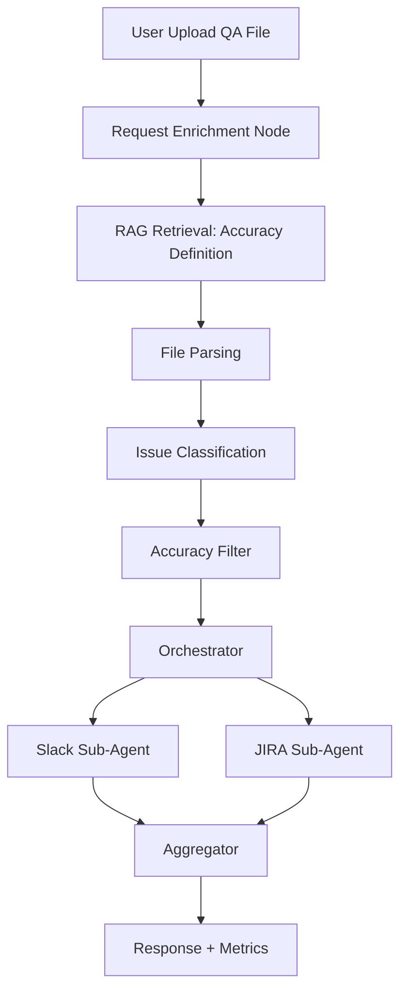

Below is a **complete, professional-standard PRD** for your production-focused AI Agent demo system.

This version:

* Elevates RAG to a core dependency
* Introduces Request Enrichment before orchestration
* Includes dynamic query generation per sub-agent
* Emphasizes production stability, latency, and observability
* Uses a fixed stack (LangGraph + LangSmith + Langfuse)

---

# PRODUCT REQUIREMENTS DOCUMENT (PRD)

---

# 1. Product Overview

## 1.1 Product Name

**Accuracy Intelligence Agent (AIA)**

---

## 1.2 Product Summary

Accuracy Intelligence Agent (AIA) is a production-grade AI system that processes uploaded QA issue lists and automatically:

1. Enriches ambiguous user intent
2. Defines “accuracy-related issues” using RAG
3. Filters issues based on semantic classification
4. Generates executive summaries
5. Creates JIRA tickets for validated issues
6. Posts summaries to Slack
7. Provides full observability and evaluation metrics

The system is designed to demonstrate **LLM Engineering in production**, not academic experimentation.

---

# 2. Product Vision

Build a robust, scalable AI workflow system that demonstrates:

* RAG-centered decision making
* Query rewriting before orchestration
* Parallel sub-agent execution
* Tool integration
* Failure isolation
* Observability-first architecture
* Low-latency mindset
* Measurable quality

---

# 3. Problem Statement

QA teams generate large issue lists.

Engineering leadership only wants:

* Issues related to “accuracy”
* A clean summary
* Immediate ticket creation for actionable problems

Challenges:

* “Accuracy” is ambiguous
* QA descriptions are inconsistent
* Duplicate tickets waste time
* Manual triage is slow
* LLM hallucination risk exists
* Lack of observability makes debugging difficult

---

# 4. Goals & Non-Goals

## 4.1 Goals

* Interpret vague user intent reliably
* Use RAG to ground classification logic
* Filter issues semantically
* Generate specialized prompts per sub-agent
* Execute Slack + JIRA in parallel
* Provide full trace visibility
* Maintain predictable latency
* Support concurrent usage

---

## 4.2 Non-Goals

* No multi-agent swarm system
* No autonomous planning agents
* No long-term memory
* No MCP/A2A protocol
* No advanced orchestrator framework

---

# 5. User Personas

### Primary

* Backend engineers
* QA engineers
* AI engineers

### Secondary

* Engineering managers

---

# 6. High-Level System Architecture



---

# 7. Technology Stack (Fixed)

Framework: LangGraph
LLM: OpenAI GPT-4o
Embedding Model: text-embedding-3-small
Vector Store: Qdrant
Backend: FastAPI
Observability: LangSmith
Evaluation & Analytics: Langfuse
Concurrency Model: Async + Parallel Graph Branches

---

# 8. Functional Requirements

---

# 8.1 File Upload

## Supported Formats

* CSV
* Excel
* Markdown
* TXT

## Endpoint

POST /qa-intake

Returns:

* request_id
* status

---

# 8.2 Request Enrichment Node

## Purpose

Transform ambiguous user instruction into structured task contract.

Example Input:

“Summarize issues related to accuracy.”

Output:

```json
{
  "task_type": "accuracy_filter",
  "requires_slack_post": true,
  "requires_ticket_creation": true,
  "confidence_threshold": 0.6
}
```

This prevents blind orchestration.

---

# 8.3 RAG Retrieval: Defining Accuracy

The system retrieves:

* Internal bug taxonomy
* Historical QA classification rules
* Definition of accuracy-related bugs
* Example labeled issues

This ensures semantic grounding.

Output:

Structured definition object used downstream.

---

# 8.4 Issue Classification

Each issue must be evaluated using:

* RAG-defined taxonomy
* Semantic similarity
* LLM reasoning

Output schema:

```json
{
  "issue_id": "...",
  "accuracy_related": true,
  "confidence": 0.83,
  "reason": "Incorrect numerical output"
}
```

If confidence < threshold:
→ Flag for manual review (future enhancement)

---

# 8.5 Accuracy Filter

Retain only issues marked as accuracy-related.

---

# 8.6 Orchestrator Node

Responsibilities:

* Generate sub-agent specific queries
* Decide execution branches
* Control parallelism
* Handle failure isolation

Important: The orchestrator DOES NOT pass raw user input.
It generates specialized instructions per sub-agent.

---

# 8.7 Slack Sub-Agent

Input: Filtered issues
Generated Query Example:

“Generate executive summary of accuracy-related QA issues. Focus on production risk.”

Output:

* Markdown summary
* Slack API call
* Message URL

---

# 8.8 JIRA Sub-Agent

Input: Filtered issues
Generated Query Example:

“Create JIRA tickets for each issue. Include reproduction steps and priority.”

For each issue:

* Duplicate detection via RAG
* Ticket creation or skip

Output:

* Ticket URLs
* Duplicate references

---

# 9. Parallel Execution Requirement

Slack and JIRA agents must run in parallel.

Total latency must approximate:

max(slack_time, jira_time)

NOT sum.

This is mandatory architectural behavior.

---

# 10. Observability Requirements

---

## 10.1 LangSmith

Must log:

* Node execution time
* Prompt inputs
* Tool outputs
* JSON validation retries
* Routing decisions

All requests must have trace_id.

---

## 10.2 Langfuse

Track:

* Number of issues processed
* Number of tickets created
* Duplicate rate
* Token usage
* Latency distribution
* Cost per request

---

# 11. Non-Functional Requirements

---

## 11.1 Performance

| Metric                     | Target                  |
| -------------------------- | ----------------------- |
| P95 latency                | < 4 seconds (10 issues) |
| Parallel branch efficiency | ≥ 30% latency reduction |
| Max file size              | 200 issues              |

---

## 11.2 Scalability

* Stateless API
* Async execution
* Horizontal scaling
* Shared vector DB
* Rate limiting per user

---

## 11.3 Reliability

* Tool call retries (max 2)
* JSON schema validation
* Failure isolation per branch
* Timeout control

---

## 11.4 Security

* API keys in environment variables
* No raw prompt logging of sensitive data
* JIRA & Slack tokens encrypted
* File upload size limit

---

# 12. Data Flow

1. User uploads file
2. System parses issues
3. Enrichment step expands intent
4. RAG retrieves accuracy taxonomy
5. Issues classified
6. Accuracy filter applied
7. Orchestrator generates sub-queries
8. Slack & JIRA run in parallel
9. Aggregator composes response
10. Logs sent to LangSmith & Langfuse

---

# 13. Error Handling

| Failure          | Behavior              |
| ---------------- | --------------------- |
| Slack fails      | Retry → continue JIRA |
| JIRA fails       | Retry per ticket      |
| RAG empty result | Abort classification  |
| Low confidence   | Flag result           |
| JSON invalid     | Retry LLM node        |

---

# 14. Success Metrics

Technical:

* Accuracy classification precision > 85%
* Duplicate detection rate > 70%
* P95 latency < 4 seconds
* Tool success rate > 95%

Adoption:

* 10 engineers onboarded
* 50 QA files processed

---

# 15. MVP Scope

Included:

* Request enrichment
* RAG classification
* Accuracy filtering
* Parallel Slack + JIRA
* Observability
* Duplicate detection

Excluded:

* Multi-agent coordination
* Swarm AI
* Long-term memory
* MCP/A2A

---

# 16. Demo Plan

1. Upload QA file
2. Show enrichment output
3. Show RAG retrieval result
4. Show classification results
5. Show parallel execution trace
6. Show Slack message
7. Show JIRA tickets
8. Inspect LangSmith trace
9. Inspect Langfuse metrics

---

# 17. Future Enhancements

* Confidence-based human approval
* Background job queue
* Streaming progress updates
* UI dashboard
* CI/CD prompt testing
* Automated evaluation suite

---

# 18. Summary

Accuracy Intelligence Agent demonstrates:

* RAG-driven semantic control
* Intent enrichment before orchestration
* Sub-agent query specialization
* Parallel tool execution
* Observability-first architecture
* Production engineering mindset

This system is intentionally designed to teach engineers how to build **stable, scalable LLM-powered products**, not isolated LLM demos.