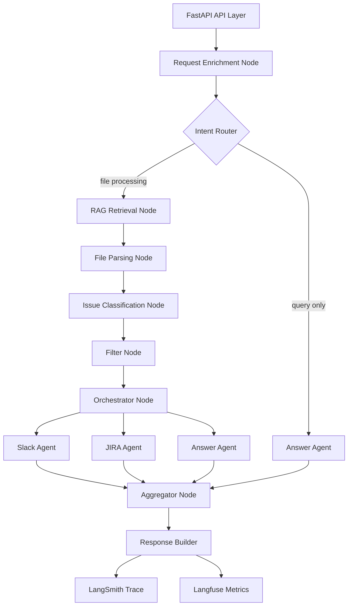

# TECHNICAL DESIGN DOCUMENT (TDD)

This document translates the PRD into concrete engineering design, system components, data contracts, execution model, and operational decisions.

---

# 1. System Overview

## 1.1 Objective

Implement a production-grade, intent-driven AI agent system that:

* Accepts any natural language QA query — with or without a file
* Dynamically extracts intent, filter criteria, and output channels
* Conditionally routes execution through the pipeline
* Uses RAG to ground classification for any QA issue type
* Activates only the agents required by the request
* Executes activated agents in parallel
* Provides full traceability and metrics

---

# 2. Architecture Overview



---

# 3. Technology Stack

| Layer | Technology |
|-------|-----------|
| API | FastAPI |
| Workflow | LangGraph |
| LLM | OpenAI GPT-4o |
| Embedding | text-embedding-3-small |
| Vector Store | Qdrant |
| Observability | LangSmith |
| Metrics & Eval | Langfuse |
| Concurrency | AsyncIO + Parallel Graph Branches |

---

# 4. Component Design

---

## 4.1 API Layer (FastAPI)

### Endpoint

POST /qa-intake

### Responsibilities

* Accept optional file upload
* Accept required instruction string
* Generate `request_id` and `trace_id`
* Initialize `AgentState`
* Trigger LangGraph workflow
* Return final structured response

### Request Model

```json
{
  "file": "multipart/form-data (optional)",
  "instruction": "string (required)"
}
```

---

## 4.2 LangGraph Workflow

Implemented as a Directed Acyclic Graph (DAG) with conditional routing.

Each node:
* Receives state
* Modifies state
* Returns updated state

State is immutable between steps.

Conditional edges determine execution path based on `enriched_task`.

---

# 5. State Schema

```json
{
  "request_id": "string",
  "trace_id": "string",
  "instruction": "string",
  "raw_file_content": "string | null",
  "file_name": "string | null",

  "enriched_task": {
    "intent": "query | filter_and_report | analyze | update",
    "requires_file_processing": "boolean",
    "filter_criteria": {
      "type": "accuracy | performance | security | critical | custom",
      "description": "string",
      "confidence_threshold": "float"
    },
    "requires_slack_post": "boolean",
    "requires_ticket_creation": "boolean",
    "requires_analysis": "boolean",
    "output_format": "executive | detailed | bullet"
  },

  "accuracy_definition": "RAGResult | null",
  "parsed_issues": [],
  "classified_issues": [],
  "filtered_issues": [],

  "slack_query": "string | null",
  "jira_query": "string | null",
  "answer_query": "string | null",

  "slack_result": {},
  "jira_result": {},
  "answer_result": {},

  "errors": [],
  "metrics": {}
}
```

---

# 6. Node-Level Design

---

## 6.1 Request Enrichment Node

### Input

* `instruction` — any natural language QA query

### Process

LLM extracts:
* `intent` — what the user wants to achieve
* `requires_file_processing` — is a file needed?
* `filter_criteria` — what to look for (type + description + threshold)
* `requires_slack_post` — post to Slack?
* `requires_ticket_creation` — create JIRA tickets?
* `requires_analysis` — return inline analysis/answer?
* `output_format` — how to format the response

### Output

```json
{
  "intent": "filter_and_report",
  "requires_file_processing": true,
  "filter_criteria": {
    "type": "accuracy",
    "description": "Issues involving incorrect outputs, wrong calculations, or misclassified data",
    "confidence_threshold": 0.6
  },
  "requires_slack_post": true,
  "requires_ticket_creation": true,
  "requires_analysis": false,
  "output_format": "executive"
}
```

### Failure Mode

If invalid JSON → retry once → fail request if still invalid

---

## 6.2 Intent Router (Conditional Edge)

After enrichment, the graph routes based on `enriched_task`:

| Condition | Route |
|-----------|-------|
| `requires_file_processing == false` | → Answer Agent directly |
| `requires_file_processing == true` | → RAG Retrieval Node |

---

## 6.3 RAG Retrieval Node

### Vector Store

* Qdrant instance with one collection per knowledge domain
* `accuracy_taxonomy` — accuracy issue definitions
* `qa_taxonomy` — general QA taxonomy (performance, security, etc.)
* `jira_tickets` — created tickets (for duplicate detection)

### Query

Derived from `filter_criteria.type` and `filter_criteria.description`.

Example for type=accuracy:
`"Definition and examples of accuracy-related QA issues"`

Example for type=performance:
`"Definition and examples of performance-related QA issues, latency bugs, and throughput degradation"`

### Output

```json
{
  "query": "original query",
  "rewritten_query": "expanded query",
  "results": [],
  "confidence": 0.87,
  "source_collection": "qa_taxonomy"
}
```

---

## 6.4 File Parsing Node

### Process

* Detect file type from extension
* Parse rows / normalize fields
* Fill missing optional fields

### Output

```json
[
  {
    "id": "1",
    "title": "...",
    "description": "...",
    "steps": "...",
    "severity": "..."
  }
]
```

No LLM involved.

---

## 6.5 Issue Classification Node

### Activation Condition

Only runs when `filter_criteria` is not null.

If `filter_criteria` is null (e.g., "summarize all issues") → skip, pass all parsed issues to filter node.

### For Each Issue Batch

Inputs:
* Issue batch
* RAG context (from retrieval node)
* `filter_criteria.description` (dynamic — not hardcoded to accuracy)

LLM task:
* Determine if issue matches `filter_criteria`
* Provide confidence
* Provide reason

### Output Schema

```json
{
  "issue_id": "1",
  "matches_criteria": true,
  "confidence": 0.82,
  "reason": "Incorrect numerical calculation"
}
```

---

## 6.6 Filter Node

Logic:

```
if filter_criteria is null → pass ALL parsed_issues through
if matches_criteria == true AND confidence >= threshold → include
```

---

## 6.7 Orchestrator Node

### Responsibilities

* Generate sub-agent specific queries
* Activate only required agents:
  * `requires_slack_post` → activate slack_agent
  * `requires_ticket_creation` → activate jira_agent
  * `requires_analysis` → activate answer_agent
* Launch parallel branches for all activated agents

### Generated Slack Query (example for accuracy)

`"Generate executive summary of accuracy-related QA issues. Focus on production risk."`

### Generated JIRA Query (example for accuracy)

`"Create JIRA tickets for each issue. Include reproduction steps and priority."`

### Generated Answer Query

`"Analyze the following QA issues and provide a detailed summary with patterns and recommendations."`

---

## 6.8 Slack Sub-Agent Node

Steps:
1. Generate summary (LLM using slack_query + filtered issues)
2. Format Markdown
3. Call Slack API
4. Return message URL

Failure handling:
* Retry twice
* If fails → store error, continue other agents

---

## 6.9 JIRA Sub-Agent Node

For each issue:
1. Duplicate detection via RAG Agent (collection: jira_tickets)
2. If similarity > threshold → skip, attach existing ticket
3. Else → generate ticket content → create via JIRA API

Uses `asyncio.gather()` with max concurrency limit: 5.

---

## 6.10 Answer Agent Node

Handles two scenarios:

**Scenario A — Direct query (no file):**
* Retrieves relevant context from Qdrant
* Answers the user's question with RAG-grounded response

**Scenario B — Analysis of filtered issues:**
* Uses filtered/processed issues as context
* Generates structured analysis: patterns, distribution, recommendations

---

## 6.11 Aggregator Node

Combines results from all activated agents:
* Slack result
* JIRA result
* Answer result
* Metrics

---

## 6.12 Response Builder

Final API response:

```json
{
  "request_id": "string",
  "intent": "string",
  "answer": "string | null",
  "summary_posted": "boolean",
  "tickets_created": "integer",
  "duplicates_skipped": "integer",
  "slack_url": "string | null",
  "jira_urls": [],
  "issues_processed": "integer",
  "issues_matched": "integer",
  "trace_id": "string",
  "errors": []
}
```

---

# 7. Concurrency Model

## 7.1 Graph-Level Parallelism

All activated agents run in parallel.

Latency formula: `Total = max(agent_A, agent_B, agent_C)`

## 7.2 Ticket-Level Parallelism

Within JIRA node: each ticket creation runs async. Max concurrency: 5.

---

# 8. Observability Design

## 8.1 LangSmith

* Graph visualization
* Node timing
* Prompt inspection
* Routing decisions
* Tool logs
* Retry logs

Trace ID passed through entire state.

## 8.2 Langfuse

Track:
* Intent distribution
* Tokens per node
* Cost per request
* Latency per path (query vs full pipeline)
* Classification accuracy
* Duplicate rate
* Agent activation rate (which agents are most used)

---

# 9. Performance Design

## 9.1 Optimization

* Embedding cache
* Batch classification
* Limit top-k retrieval to 4
* Early exit if no matching issues found
* Skip RAG and classification if `filter_criteria` is null

## 9.2 Latency Targets

| Path | Target |
|------|--------|
| Query only (no file) | < 2s |
| RAG retrieval | < 300ms |
| Classification (10 issues) | < 1.5s |
| Slack posting | < 800ms |
| JIRA creation (parallel) | < 2s |
| Full pipeline P95 | < 4s |

---

# 10. Error Handling Strategy

## Node-Level Failure Isolation

Each activated agent branch is independent. Failure in one does not abort others.

System aborts entirely only if:
* Enrichment fails (no task contract = no routing possible)

## Retry Policy

| Component | Retries |
|-----------|---------|
| Enrichment JSON | 1 |
| Classification JSON | 1 |
| Slack API | 2 |
| JIRA API | 2 per ticket |

---

# 11. Security Design

* Environment-based secrets
* No raw prompt storage of sensitive info
* File size limit (max 200 issues)
* Rate limiting per user

---

# 12. Deployment Architecture

Single container MVP:
* FastAPI
* LangGraph
* Qdrant local instance (Docker)

Production scalable:
* FastAPI behind load balancer
* Shared Qdrant instance
* Horizontal scale workers

---

# 13. Testing Strategy

## 13.1 Unit Tests

* File parsing (all formats)
* Filter logic (threshold edge cases)
* Enrichment output schema validation
* Classification output schema validation

## 13.2 Integration Tests

* End-to-end workflow (full pipeline with mocked Slack/JIRA)
* Query-only path (no file)
* RAG retrieval accuracy

## 13.3 Load Testing

Simulate:
* 10 concurrent uploads
* 100-issue file

---

# 14. Summary

This Technical Design Document defines:

* Intent-driven pipeline with conditional routing
* Dynamic filter criteria (not hardcoded to any type)
* Structured state management with full type contracts
* RAG-grounded classification for any QA concern
* Dynamic agent activation and parallel execution
* Full observability integration
* Clear failure isolation and retry policies

This is a real production-style LLM system design suitable for teaching engineers how to build **flexible, intent-driven, scalable AI agent products**.
