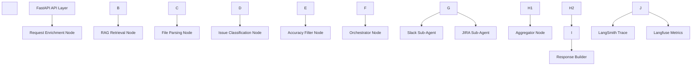

Below is the \*\*Technical Design Document (TDD)\*\* for the Accuracy Intelligence Agent (AIA).


This document translates the PRD into concrete engineering design, system components, data contracts, execution model, and operational decisions.


---


\# TECHNICAL DESIGN DOCUMENT (TDD)


---


\# 1. System Overview


\## 1.1 Objective


Implement a production-grade AI workflow system that:


\* Accepts QA issue file uploads

\* Enriches user intent

\* Uses RAG to define “accuracy-related issues”

\* Classifies issues semantically

\* Filters accuracy-related issues

\* Generates specialized sub-agent queries

\* Executes Slack + JIRA tasks in parallel

\* Provides full traceability and metrics


---


\# 2. Architecture Overview





---


\# 3. Technology Stack


| Layer          | Technology                        |

| -------------- | --------------------------------- |

| API            | FastAPI                           |

| Workflow       | LangGraph                         |

| LLM            | OpenAI GPT-4o                     |

| Embedding      | text-embedding-3-small            |

| Vector Store   | Qdrant                            |

| Observability  | LangSmith                         |

| Metrics \& Eval | Langfuse                          |

| Concurrency    | AsyncIO + Parallel Graph Branches |


---


\# 4. Component Design


---


\# 4.1 API Layer (FastAPI)


\### Endpoint


POST /qa-intake


\### Responsibilities


\* Accept file upload

\* Generate request\_id

\* Initialize trace

\* Trigger LangGraph workflow

\* Return final result


\### Request Model


```json

{

&nbsp; "file": "multipart/form-data",

&nbsp; "user\_id": "string",

&nbsp; "instruction": "string"

}

```


---


\# 4.2 LangGraph Workflow


We implement the system as a Directed Acyclic Graph (DAG).


Each node:


\* Receives state

\* Modifies state

\* Returns updated state


State is immutable between steps.


---


\# 5. State Schema


Global State Object:


```json

{

&nbsp; "request\_id": "string",

&nbsp; "raw\_file": "binary",

&nbsp; "parsed\_issues": \[],

&nbsp; "enriched\_task": {},

&nbsp; "accuracy\_definition": {},

&nbsp; "classified\_issues": \[],

&nbsp; "accuracy\_issues": \[],

&nbsp; "slack\_result": {},

&nbsp; "jira\_result": {},

&nbsp; "errors": \[],

&nbsp; "metrics": {}

}

```


---


\# 6. Node-Level Design


---


\# 6.1 Request Enrichment Node


\### Input


\* user instruction


\### Process


LLM prompt:


\* Normalize intent

\* Extract required actions

\* Define filtering intent


\### Output


```json

{

&nbsp; "task\_type": "accuracy\_filter",

&nbsp; "requires\_slack": true,

&nbsp; "requires\_jira": true,

&nbsp; "confidence\_threshold": 0.6

}

```


\### Failure Mode


If invalid JSON:

→ Retry once

→ Fail request if still invalid


---


\# 6.2 RAG Retrieval Node


\### Vector Store Setup


\* Qdrant collection (`accuracy_taxonomy`)

\* Embedded internal documents:


&nbsp; \* QA taxonomy

&nbsp; \* Bug classification guide

&nbsp; \* Historical accuracy issues


\### Query


Use enriched\_task.task\_type as query seed.


Example:


“Definition and examples of accuracy-related QA issues.”


\### Output


```json

{

&nbsp; "accuracy\_categories": \[],

&nbsp; "examples": \[]

}

```


---


\# 6.3 File Parsing Node


\### Process


\* Detect file type

\* Parse rows

\* Normalize fields


\### Output


```json

\[

&nbsp; {

&nbsp;   "id": "1",

&nbsp;   "title": "...",

&nbsp;   "description": "...",

&nbsp;   "steps": "...",

&nbsp;   "severity": "..."

&nbsp; }

]

```


No LLM involved.


---


\# 6.4 Issue Classification Node


\### For Each Issue


Inputs:


\* Issue object

\* Accuracy definition (from RAG)


LLM task:


\* Determine if issue relates to accuracy

\* Provide confidence

\* Provide reason


\### Output Schema


```json

{

&nbsp; "issue\_id": "1",

&nbsp; "accuracy\_related": true,

&nbsp; "confidence": 0.82,

&nbsp; "reason": "Incorrect numeric calculation"

}

```


\### Optimization


Batch classification in groups of 5–10 issues.


---


\# 6.5 Accuracy Filter Node


Logic:


```

if accuracy\_related == true

AND confidence >= threshold

→ include

```


Result stored in:


accuracy\_issues\[]


---


\# 6.6 Orchestrator Node


\### Responsibilities


\* Generate sub-agent queries

\* Create branch execution state

\* Launch parallel nodes


\### Generated Slack Query


Example:


“Generate executive summary of the following accuracy-related QA issues. Highlight risk and production impact.”


\### Generated JIRA Query


Example:


“For each issue, create structured JIRA ticket with priority recommendation.”


---


\# 6.7 Slack Sub-Agent Node


\### Steps


1\. Generate summary (LLM)

2\. Format Markdown

3\. Call Slack API

4\. Return message URL


\### Failure Handling


\* Retry twice

\* If fails → store error, continue workflow


---


\# 6.8 JIRA Sub-Agent Node


\### For Each Issue


1\. Duplicate detection (RAG similarity)

2\. If similarity > threshold:


&nbsp;  \* Skip creation

&nbsp;  \* Attach existing ticket link

3\. Else:


&nbsp;  \* Create ticket via API


\### Parallelization Strategy


Use asyncio.gather() for ticket creation.


---


\# 6.9 Aggregator Node


Combine:


\* Slack result

\* JIRA result

\* Duplicate info

\* Metrics


---


\# 6.10 Response Builder


Final API response:


```json

{

&nbsp; "summary\_posted": true,

&nbsp; "tickets\_created": 3,

&nbsp; "duplicates\_skipped": 2,

&nbsp; "slack\_url": "...",

&nbsp; "jira\_urls": \["..."],

&nbsp; "trace\_id": "..."

}

```


---


\# 7. Concurrency Model


---


\## 7.1 Graph-Level Parallelism


Slack and JIRA branches execute in parallel.


Latency formula:


Total = max(branch A, branch B)


---


\## 7.2 Ticket-Level Parallelism


Within JIRA node:


\* Each ticket creation runs async

\* Max concurrency limit: 5

\* Prevent API rate limit


---


\# 8. Observability Design


---


\# 8.1 LangSmith


Enable:


\* Graph visualization

\* Node timing

\* Prompt inspection

\* Tool logs

\* Retry logs


Trace ID passed through entire state.


---


\# 8.2 Langfuse


Track:


\* Tokens per node

\* Cost per request

\* Latency per branch

\* Classification accuracy distribution

\* Duplicate rate


---


\# 9. Performance Design


---


\## 9.1 Optimization


\* Embedding cache

\* Batch classification

\* Limit top-k retrieval to 4

\* Early exit if no accuracy issues found


---


\## 9.2 Latency Targets


| Step           | Target             |

| -------------- | ------------------ |

| RAG retrieval  | < 300ms            |

| Classification | < 1.5s (10 issues) |

| Slack posting  | < 800ms            |

| JIRA creation  | < 2s (parallel)    |


---


\# 10. Error Handling Strategy


---


\## Node-Level Failure Isolation


Slack failure ≠ JIRA failure.


System must not abort entire workflow unless:


\* RAG fails

\* Classification fails completely


---


\## Retry Policy


| Component       | Retries      |

| --------------- | ------------ |

| LLM JSON output | 1            |

| Slack API       | 2            |

| JIRA API        | 2 per ticket |


---


\# 11. Security Design


\* Environment-based secrets

\* No raw prompt storage of sensitive info

\* File size limit

\* Rate limiting per user


---


\# 12. Deployment Architecture


Single container MVP:


\* FastAPI

\* LangGraph

\* Qdrant local instance (Docker)


Production scalable:


\* FastAPI behind load balancer

\* Redis (optional session store)

\* Shared vector index

\* Horizontal scale workers


---


\# 13. Testing Strategy


---


\## 13.1 Unit Tests


\* File parsing

\* Classification schema validation

\* Filter logic

\* Duplicate detection threshold


---


\## 13.2 Integration Tests


\* End-to-end workflow

\* Slack API mock

\* JIRA API mock


---


\## 13.3 Load Testing


Simulate:


\* 10 concurrent uploads

\* 100-issue file


Measure:


\* Latency

\* Memory

\* API rate stability


---


\# 14. Scalability Roadmap


Future improvements:


\* Background job queue

\* Distributed task execution

\* Streaming progress updates

\* Human approval workflow

\* CI prompt regression testing


---


\# 15. Summary


This Technical Design Document defines:


\* Explicit node responsibilities

\* Structured state management

\* RAG-grounded classification

\* Intent enrichment before orchestration

\* Parallel branch execution

\* Tool-level concurrency

\* Full observability integration

\* Clear failure isolation


This is a real production-style LLM system design suitable for teaching engineers how to build stable, scalable AI products.

