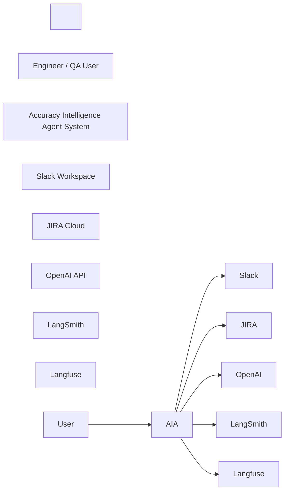
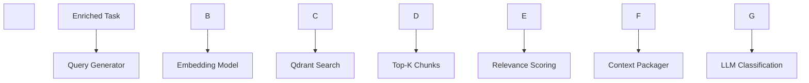
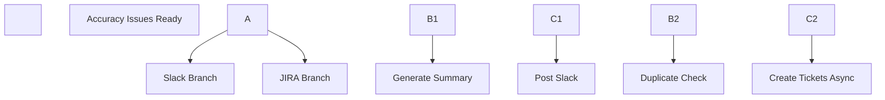
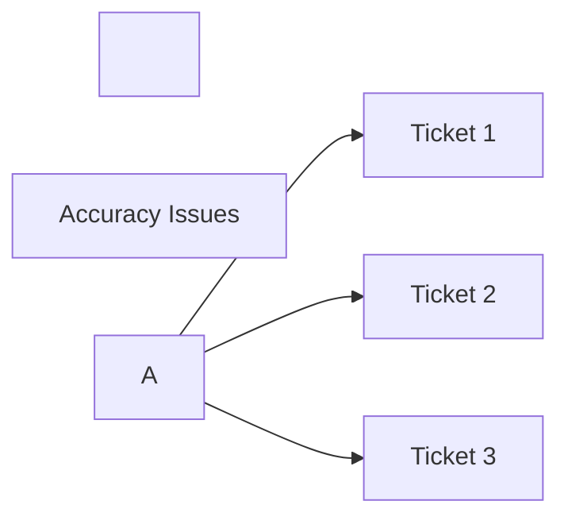
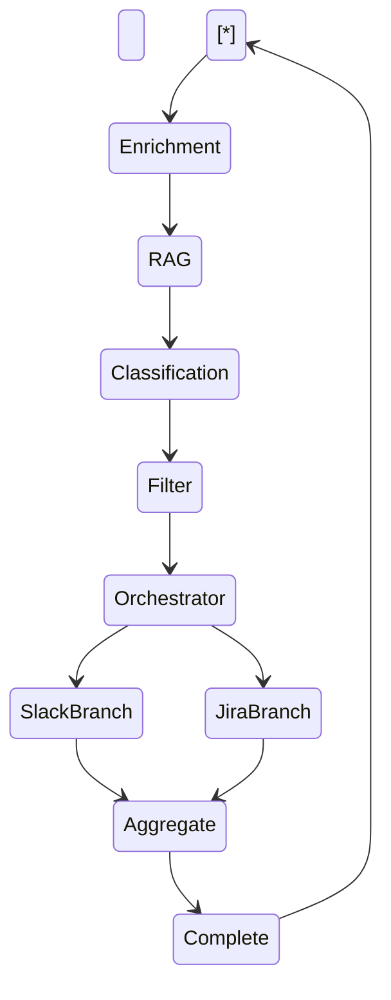
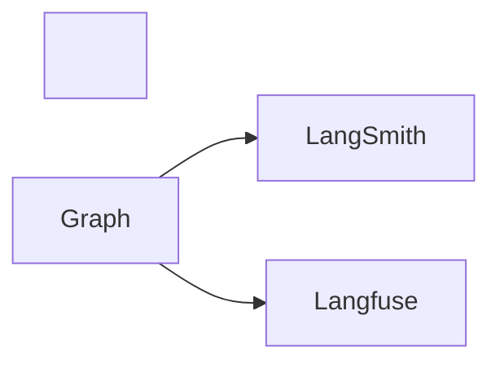
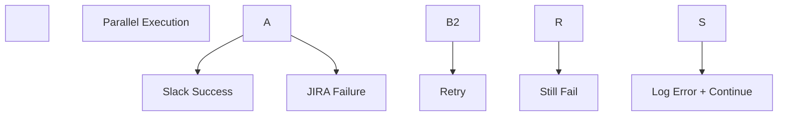
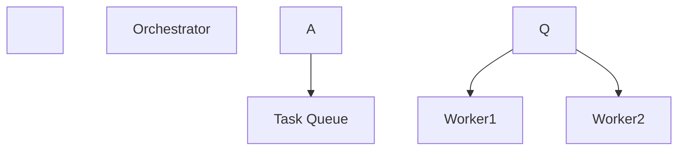
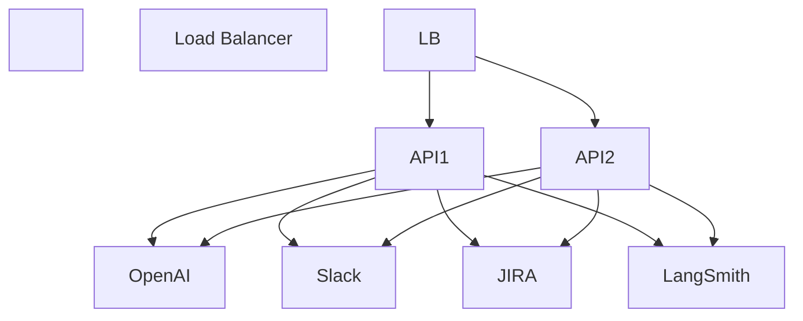
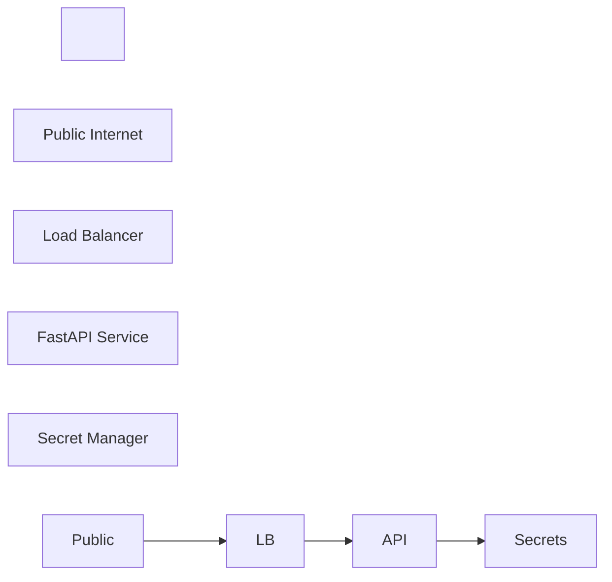

Excellent.

Below is an \*\*extended Technical Design Addendum\*\* with deeper system-level documentation and multiple production-grade diagrams that you can paste directly into slides or architecture documents.


This expands the TDD into:


\* C4-style architecture views

\* Sequence diagrams

\* Concurrency model diagram

\* RAG internal pipeline diagram

\* Observability architecture

\* Failure handling architecture

\* Deployment topology

\* Data contract definitions

\* Scaling strategy

\* Cost control strategy


---


\# TECHNICAL DESIGN DOCUMENT — EXTENDED ARCHITECTURE


---


\# 1. C4 Architecture View


---


\## 1.1 Level 1 — System Context





Purpose:

Shows external dependencies and integration boundaries.


---


\## 1.2 Level 2 — Container View


```mermaid

flowchart TB

&nbsp;   Client\[Web / CLI Client]


&nbsp;   subgraph Backend

&nbsp;       API\[FastAPI Service]

&nbsp;       Graph\[LangGraph Engine]

&nbsp;       RAG\[Vector Store (Qdrant)]

&nbsp;       Parser\[File Parser]

&nbsp;       SlackAgent\[Slack Agent]

&nbsp;       JiraAgent\[JIRA Agent]

&nbsp;   end


&nbsp;   OpenAI\[OpenAI GPT-4o]

&nbsp;   Slack\[Slack API]

&nbsp;   JIRA\[JIRA API]

&nbsp;   LangSmith\[LangSmith]

&nbsp;   Langfuse\[Langfuse]


&nbsp;   Client --> API

&nbsp;   API --> Graph

&nbsp;   Graph --> Parser

&nbsp;   Graph --> RAG

&nbsp;   Graph --> SlackAgent

&nbsp;   Graph --> JiraAgent

&nbsp;   Graph --> OpenAI

&nbsp;   SlackAgent --> Slack

&nbsp;   JiraAgent --> JIRA

&nbsp;   Graph --> LangSmith

&nbsp;   Graph --> Langfuse

```


---


\# 2. Detailed Execution Sequence


---


\## 2.1 End-to-End Request Flow


```mermaid

sequenceDiagram

&nbsp;   participant User

&nbsp;   participant API

&nbsp;   participant Graph

&nbsp;   participant RAG

&nbsp;   participant LLM

&nbsp;   participant Slack

&nbsp;   participant JIRA


&nbsp;   User->>API: Upload QA File

&nbsp;   API->>Graph: Start Workflow


&nbsp;   Graph->>LLM: Enrichment Prompt

&nbsp;   LLM-->>Graph: Structured Task


&nbsp;   Graph->>RAG: Retrieve Accuracy Definition

&nbsp;   RAG-->>Graph: Definition Context


&nbsp;   Graph->>LLM: Classify Issues

&nbsp;   LLM-->>Graph: Classification Output


&nbsp;   par Parallel Branches

&nbsp;       Graph->>Slack: Post Summary

&nbsp;       Slack-->>Graph: Slack URL

&nbsp;   and

&nbsp;       Graph->>JIRA: Create Tickets

&nbsp;       JIRA-->>Graph: Ticket URLs

&nbsp;   end


&nbsp;   Graph-->>API: Final Response

&nbsp;   API-->>User: JSON Response

```


---


\# 3. RAG Internal Pipeline


This clarifies how RAG is not “just retrieval.”





---


\## 3.1 Retrieval Logic


Query:


"Definition and classification rules for accuracy-related QA issues."


Search:


\* Top 5 semantic matches

\* Similarity threshold ≥ 0.72


Relevance scoring:


\* Rerank top 5

\* Keep top 3


Context assembly:


\* Merge

\* Remove duplicates

\* Attach metadata


---


\# 4. Concurrency Model


---


\## 4.1 Parallel Branch Architecture





Execution:


\* asyncio.gather()

\* Branch timeout control

\* Independent error handling


---


\## 4.2 Internal Ticket-Level Parallelism





Concurrency limit: 5 simultaneous calls.


---


\# 5. State Machine View





---


\# 6. Observability Architecture


---


\## 6.1 Logging \& Trace Flow





\### LangSmith Tracks


\* Node execution time

\* Prompt inputs

\* Tool outputs

\* Retry attempts

\* JSON validation errors

\* Branch execution time


\### Langfuse Tracks


\* Token usage per node

\* Cost per request

\* Classification precision

\* Duplicate rate

\* Slack/JIRA success rate


---


\# 7. Failure Isolation Model


---





Policy:


Slack failure does not block JIRA.

JIRA failure per ticket does not block other tickets.


---


\# 8. Data Contracts


---


\## 8.1 Classification Output Contract


```json

{

&nbsp; "issue\_id": "string",

&nbsp; "accuracy\_related": "boolean",

&nbsp; "confidence": "float",

&nbsp; "reason": "string"

}

```


Validation:


\* confidence between 0 and 1

\* accuracy\_related boolean

\* reason non-empty if true


---


\## 8.2 Slack Agent Contract


Input:


```json

{

&nbsp; "issues": \[],

&nbsp; "tone": "executive"

}

```


Output:


```json

{

&nbsp; "summary\_markdown": "...",

&nbsp; "slack\_url": "..."

}

```


---


\## 8.3 JIRA Agent Contract


Input:


```json

{

&nbsp; "issues": \[]

}

```


Output:


```json

{

&nbsp; "created": \[],

&nbsp; "duplicates": \[]

}

```


---


\# 9. Cost Control Strategy


---


\## 9.1 Cost Layers


1\. Embedding cost

2\. Classification cost

3\. Slack summary generation cost

4\. Ticket generation cost


---


\## 9.2 Optimization Strategy


\* Batch classification

\* Cache embeddings

\* Early exit if no accuracy issues

\* Limit max issues per file

\* Reduce prompt verbosity


---


\# 10. Scalability Design


---


\## 10.1 Horizontal Scaling


Stateless FastAPI containers:


\* Load balancer

\* Shared Qdrant instance

\* Shared secret store


---


\## 10.2 Background Task Extension (Future)


Move Slack + JIRA to queue system:





---


\# 11. Deployment Topology


---





---


\# 12. Latency Budget Breakdown


| Stage          | Expected      |

| -------------- | ------------- |

| Enrichment     | 600ms         |

| RAG            | 300ms         |

| Classification | 1.5s          |

| Slack Branch   | 800ms         |

| JIRA Branch    | 2s (parallel) |

| Total P95      | < 4s          |


---


\# 13. Edge Case Handling


---


\## Case 1: No Accuracy Issues Found


Return:


\* Slack message stating no critical accuracy issues

\* No JIRA tickets created


---


\## Case 2: Low Confidence Across All Issues


Return:


\* “Classification confidence low. Manual review recommended.”


---


\## Case 3: Slack API Rate Limit


\* Retry with exponential backoff

\* Continue workflow


---


\# 14. Security Boundary Diagram





Secrets:


\* OpenAI key

\* Slack token

\* JIRA token


---


\# 15. Evaluation Strategy


Offline evaluation:


\* Golden dataset of labeled QA issues

\* Measure precision / recall

\* Tune confidence threshold


Online evaluation:


\* Compare predicted duplicates vs actual duplicates

\* Monitor classification drift


---


\# 16. Final Architectural Principles


This system enforces:


\* Intent enrichment before execution

\* RAG-grounded classification

\* Deterministic state transitions

\* Parallel execution for latency control

\* Failure isolation

\* Observability-first design

\* Measurable quality

\* Scalable stateless backend


---


If you want, next I can provide:


\* A full folder structure blueprint

\* LangGraph node-by-node pseudo-code

\* A live demo teaching script with intentional failure injection

\* Or a production readiness checklist suitable for real deployment


