# TECHNICAL DESIGN DOCUMENT — EXTENDED ARCHITECTURE

---

# 1. C4 Architecture View

---

## 1.1 Level 1 — System Context

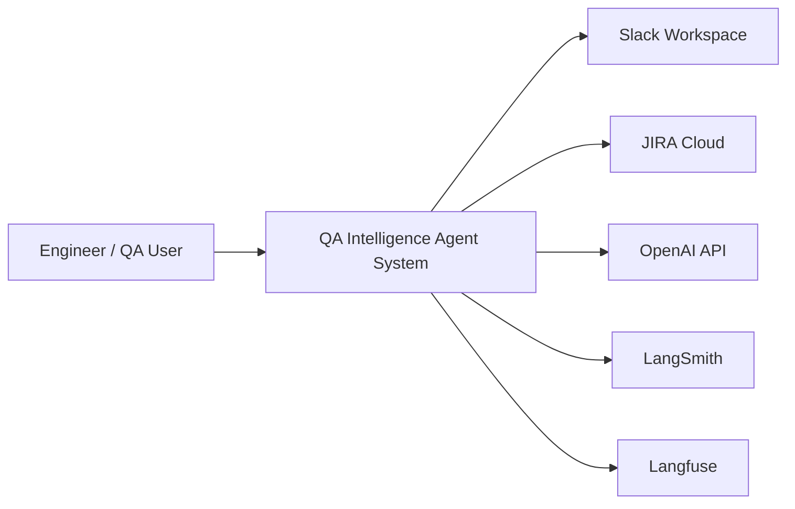

Purpose: Shows external dependencies and integration boundaries.

---

## 1.2 Level 2 — Container View

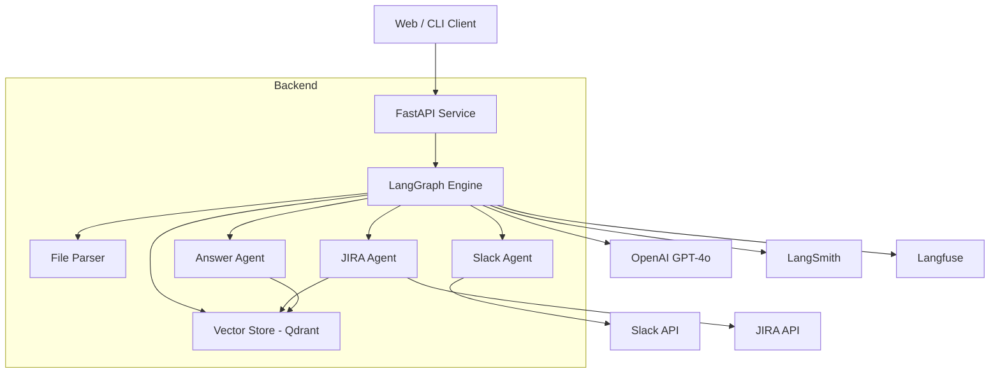

---

# 2. Detailed Execution Sequence

---

## 2.1 Full Pipeline — File + Filter + Slack + JIRA

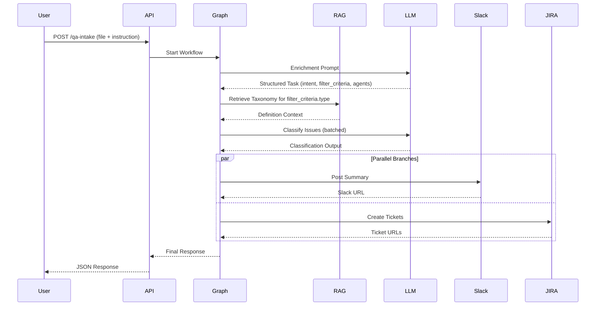

---

## 2.2 Query-Only Path — No File

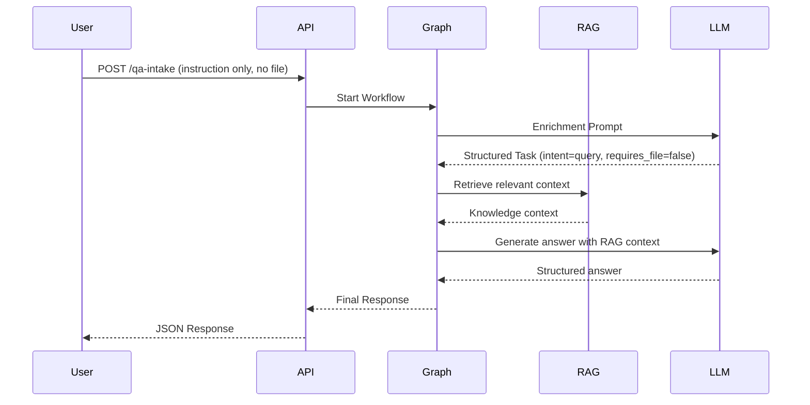

---

# 3. Intent Routing Flow

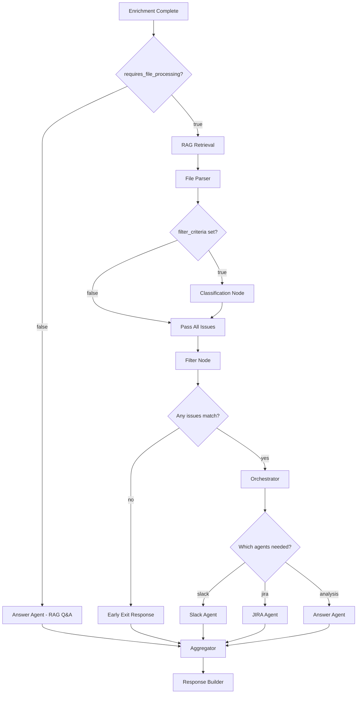

---

# 4. RAG Internal Pipeline

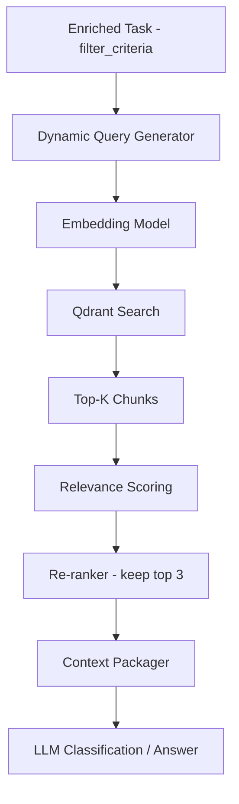

## 4.1 Retrieval Logic

Query: dynamically built from `filter_criteria.type` + `filter_criteria.description`

Search:
* Top 5 semantic matches
* Similarity threshold ≥ 0.72

Relevance scoring:
* Rerank top 5
* Keep top 3

Context assembly:
* Merge, remove duplicates, attach metadata

---

# 5. Concurrency Model

## 5.1 Dynamic Parallel Branch Architecture

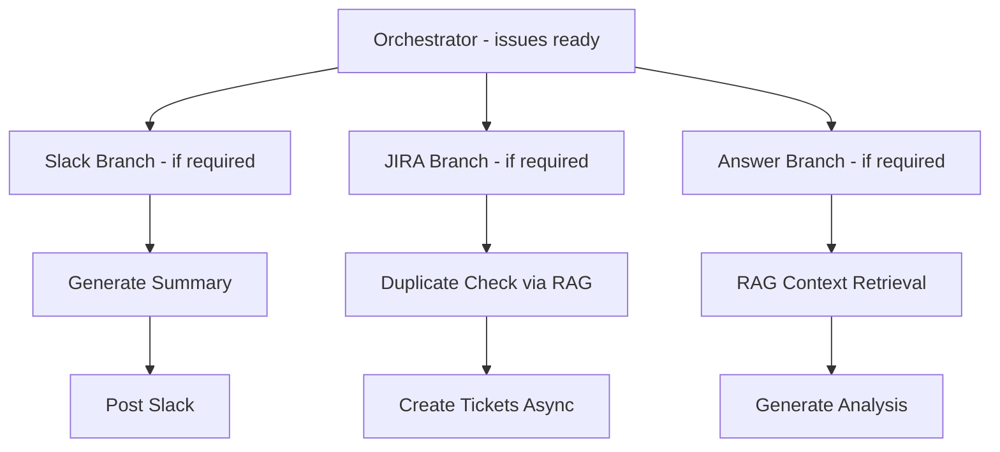

Execution: `asyncio.gather()` across all active branches.
Inactive branches (flag = false) are skipped entirely.

---

## 5.2 Ticket-Level Parallelism

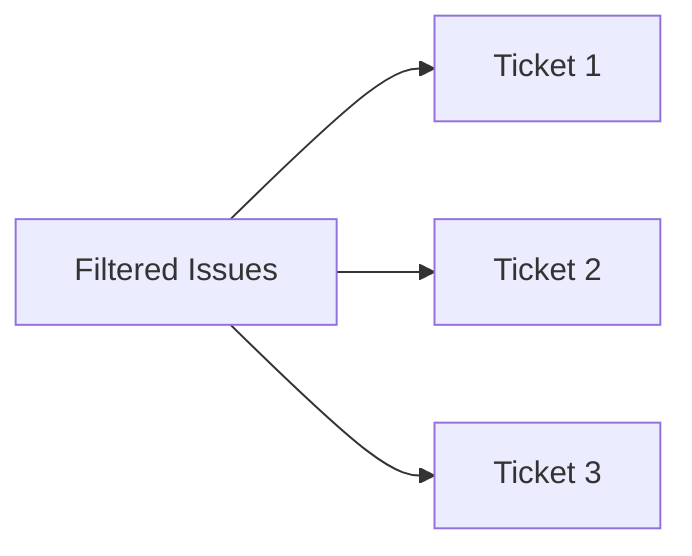

Concurrency limit: 5 simultaneous calls.

---

# 6. State Machine View

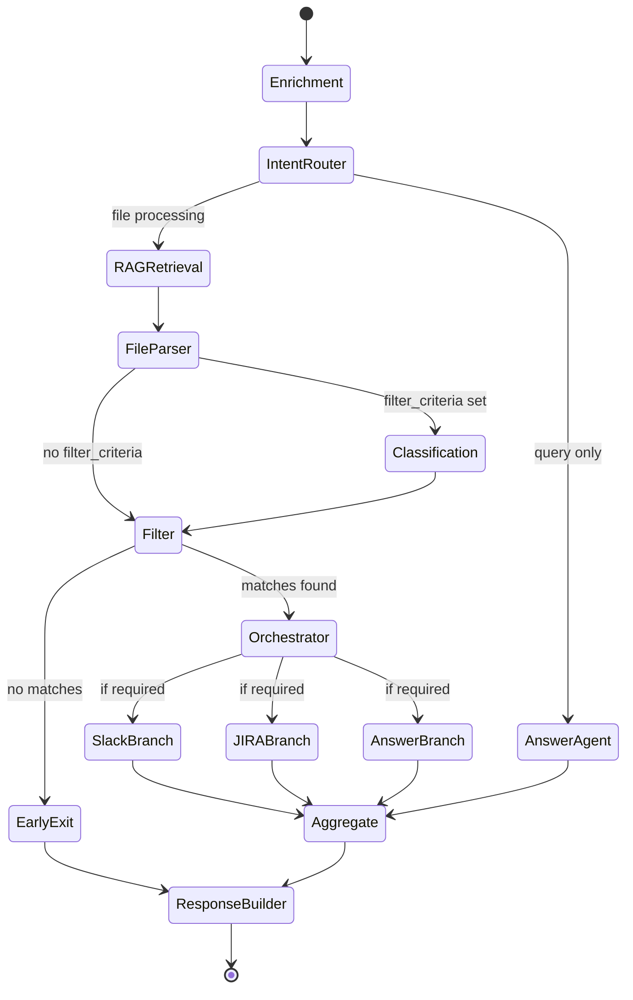

---

# 7. Observability Architecture

## 7.1 Logging & Trace Flow

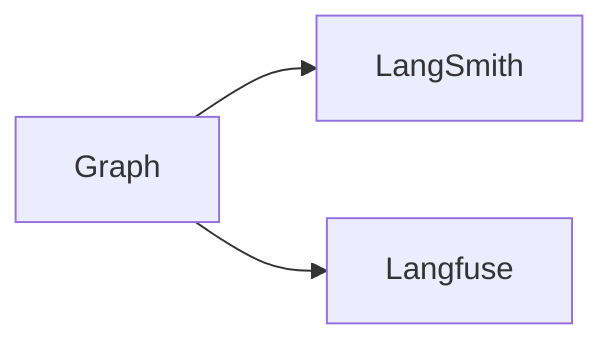

### LangSmith Tracks

* Node execution time
* Prompt inputs
* Tool outputs
* Retry attempts
* JSON validation errors
* Branch execution time
* **Routing decisions** (which path was taken, which agents activated)

### Langfuse Tracks

* Token usage per node
* Cost per request
* Classification precision
* Duplicate rate
* Slack/JIRA success rate
* **Intent distribution** (query vs filter vs analyze vs update)
* **Agent activation rate** (which agents are most commonly used)

---

# 8. Failure Isolation Model

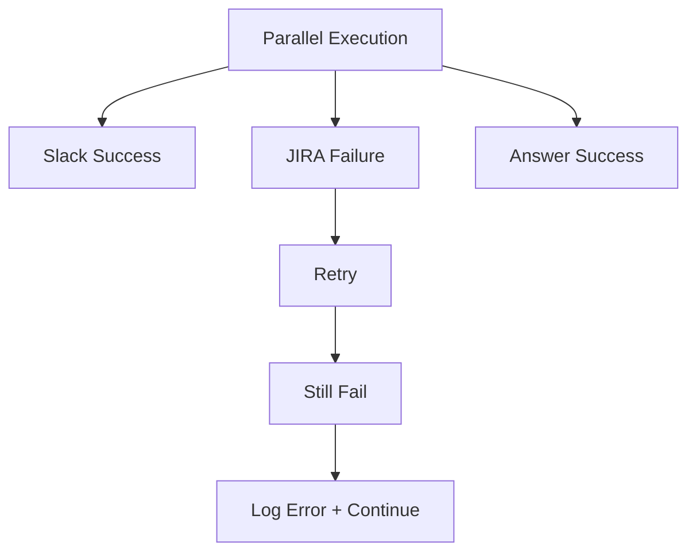

Policy:
* Any single agent failure does not block other agents
* JIRA failure per ticket does not block other tickets
* If ALL agents fail → return partial response with errors

---

# 9. Data Contracts

## 9.1 EnrichedTask Contract

```json
{
  "intent": "query | filter_and_report | analyze | update",
  "requires_file_processing": "boolean",
  "filter_criteria": {
    "type": "accuracy | performance | security | critical | custom",
    "description": "string",
    "confidence_threshold": "float 0.0-1.0"
  },
  "requires_slack_post": "boolean",
  "requires_ticket_creation": "boolean",
  "requires_analysis": "boolean",
  "output_format": "executive | detailed | bullet"
}
```

## 9.2 Classification Output Contract

```json
{
  "issue_id": "string",
  "matches_criteria": "boolean",
  "confidence": "float",
  "reason": "string"
}
```

Validation:
* confidence between 0 and 1
* matches_criteria boolean
* reason non-empty if matches_criteria is true

## 9.3 Answer Agent Contract

Input:
```json
{
  "query": "string",
  "context_issues": [],
  "rag_context": "string"
}
```

Output:
```json
{
  "answer": "string",
  "sources": [],
  "confidence": "float"
}
```

## 9.4 Slack Agent Contract

Input:
```json
{
  "issues": [],
  "slack_query": "string"
}
```

Output:
```json
{
  "summary_markdown": "string",
  "slack_url": "string"
}
```

## 9.5 JIRA Agent Contract

Input:
```json
{
  "issues": [],
  "jira_query": "string"
}
```

Output:
```json
{
  "created": [],
  "duplicates": []
}
```

---

# 10. Cost Control Strategy

## 10.1 Cost Layers

1. Enrichment cost (1 LLM call per request)
2. RAG embedding cost (conditional)
3. Classification cost (conditional, batched)
4. Answer generation cost (conditional)
5. Slack summary generation cost (conditional)
6. Ticket generation cost (conditional, per ticket)

## 10.2 Optimization Strategy

* Skip RAG + classification if `filter_criteria` is null
* Skip all agent calls if no file + pure query → only 1 LLM call (enrichment) + Answer Agent
* Batch classification
* Cache embeddings
* Early exit if no issues match
* Limit max issues per file

---

# 11. Scalability Design

## 11.1 Horizontal Scaling

Stateless FastAPI containers:
* Load balancer
* Shared Qdrant instance
* Shared secret store

## 11.2 Background Task Extension (Future)

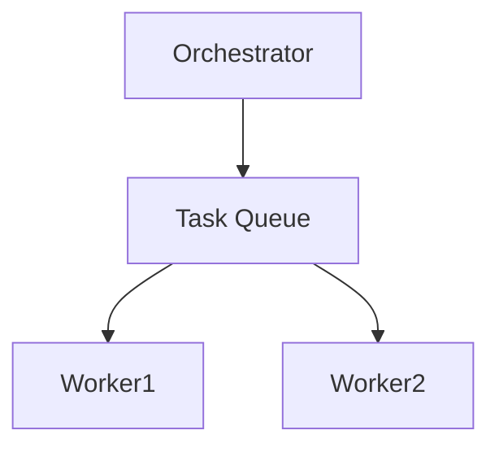

---

# 12. Latency Budget Breakdown

| Path | Stage | Expected |
|------|-------|----------|
| Query only | Enrichment + Answer | < 2s total |
| Full pipeline | Enrichment | 600ms |
| | RAG retrieval | 300ms |
| | Classification (10 issues) | 1.5s |
| | Slack Branch | 800ms |
| | JIRA Branch (parallel) | 2s |
| | **Total P95** | **< 4s** |

---

# 13. Edge Case Handling

## Case 1: No Matching Issues Found

Return:
* Slack message: "No issues matched the specified criteria"
* No JIRA tickets created
* Answer: summary of what was searched and why nothing matched

## Case 2: Low Confidence Across All Issues

Return:
* "Classification confidence low. Manual review recommended."
* Include all issues with their confidence scores

## Case 3: No File Uploaded But File Required

Return:
* Error: "This request requires a file upload. Please attach a QA issues file."

## Case 4: Slack API Rate Limit

* Retry with exponential backoff
* Continue other agent branches

---

# 14. Security Boundary Diagram

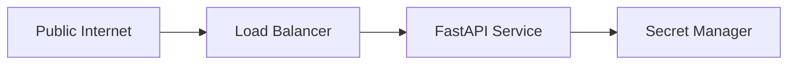

Secrets:
* OpenAI key
* Slack token
* JIRA token

---

# 15. Evaluation Strategy

Offline evaluation:
* Golden dataset of labeled QA issues (10 issues, mixed types)
* Measure intent extraction accuracy
* Measure classification precision / recall per criteria type
* Tune confidence thresholds

Online evaluation:
* Monitor intent distribution in Langfuse
* Track classification drift per issue type
* Compare predicted duplicates vs actual

---

# 16. Final Architectural Principles

This system enforces:

* Intent enrichment before execution
* Dynamic criteria extraction (not hardcoded)
* Conditional pipeline routing — only run what's needed
* RAG-grounded classification for any concern type
* Deterministic state transitions
* Parallel execution for latency control
* Failure isolation per agent branch
* Observability-first design
* Measurable quality per path
* Scalable stateless backend
